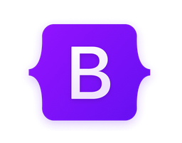

<p align="center">
  <a href="./LICENSE"></a>




</p>

[](./LICENSE)

# Bootstrap v4 Right to left (rtl)


Right To left Edition of Bootstrap v4 for Right To Left(rtl) languages like Farsi and Arabic

## Table of contents

- [Bootstrap v4 Right to left (rtl)](#bootstrap-v4-right-to-left-rtl)
  - [Table of contents](#table-of-contents)
  - [how to use](#how-to-use)
  - [License](#license)

## how to use

```PowerShell
npm run minify-css
```

js code:

```javascript
console.log('smfaramarzirad');
```

## License

[MIT](./LICENSE)
